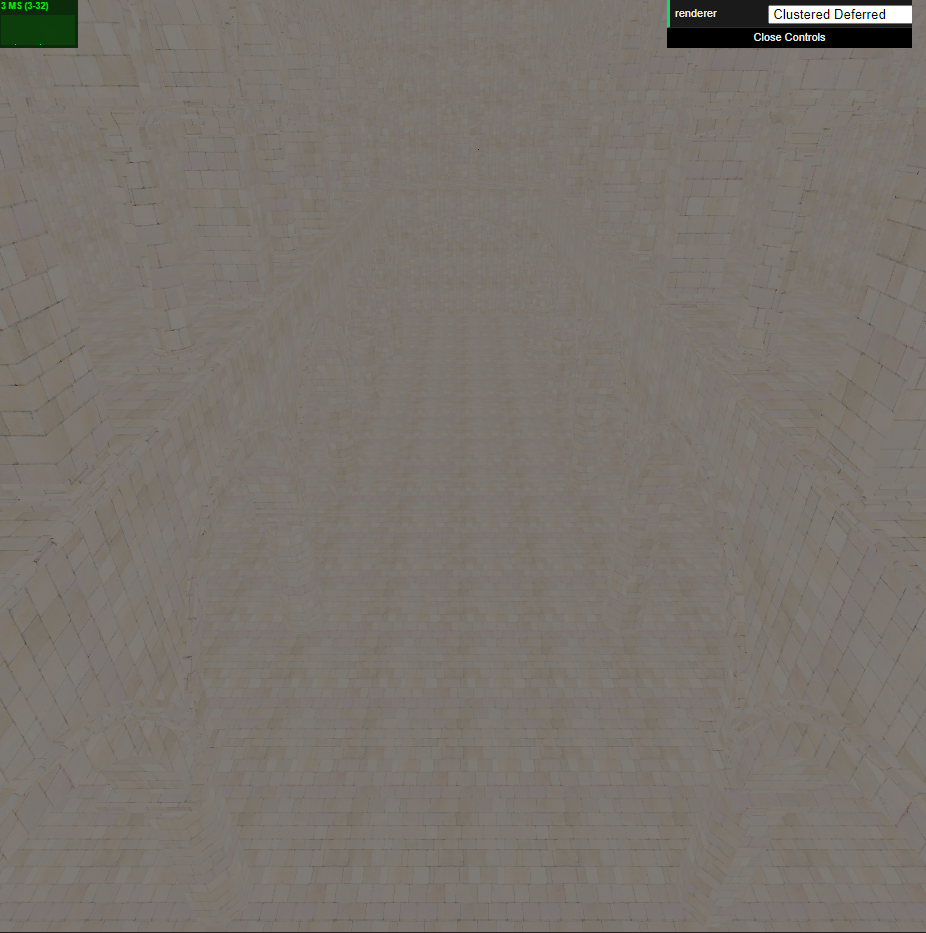

WebGL Forward+ and Clustered Deferred Shading
======================

**University of Pennsylvania, CIS 565: GPU Programming and Architecture, Project 5**

* Shubham Sharma
  * [LinkedIn](www.linkedin.com/in/codeshubham), [personal website](https://shubhvr.com/).
* Tested on: Windows 10, i7-9750H @ 2.26GHz, 16GB, GTX 1660ti 6GB (Personal Computer).
*GPU Compute Capability: 7.5

### Live Online

[Live Link](http://codeplay9800.github.io/Project5-WebGL-Forward-Plus-and-Clustered-Deferred)

### Demo Video/GIF

**Buffer Images**
- Position

- Normal

- Albedo

### Overview

This project highlights the performance differences between Forward, Forward+ clustered and Deferred clustered shading schemes. 
- Forward : Implementation of Forward shading in this project has been updated to calculate the visible object Mesh once and iterating through all the lights in the scene to shade the visible mesh or vertices.
-  Forward+ : The Scene is divided into tiled frustum clusters, which expand along the X, Y and Z axes. The Scene objects are shaded only iterating through the lights which affect them or the lights which affect the clusters in which the object lies in.
- Deferred Clustered : This required multiple passes of the OpenGL draw pipeline. Scene information is stored as G Buffers in the first pass and the scene is shaded using the same cluster methodology as Forward+ Shading.    

### Performance Analysis 
In Theory Expected Performance : Deferred Clustered >  Forward+ > Forward

- **Forward+ > Forward** : This is attributed towards the number of lights calculation that finally affects a vertex. In Forward we are calculating the resultant color of an object vertex due to every light in the scene regardless of weather the light affects the object vertex. Where as i Forward+ we take into account the number of light affecting the object vertex so overall the lighting computation decreases.
-  **Deferred Clustered > Forward+** : This is also attributed towards the number of light calculations that finally affects the vertex. But the difference comes into play due to multiple passes in Deferred Clustered. Since we store the position attributes in a Texture buffer once, the second pass of the fragment shader doesn't have to do light calculation for multiple fragment for the same pixel as we are left with only one fragment per pixel. Only the smallest depth fragments is left and all the others gets deleted off during the first pass. Whereas in the Forward+ lighting calculation is done for all the fragments for a particular pixel, the lowest one is kept while the others are discarded after the fragment shader stage. The downside is that we can't have transparence in our scene.   

### Performance Charts
I have to used debug mode in order to get substantial analyses. To analyze this data, I used Google Chrome's built-in performance tools, which allows me to view the function calls in a tick() of the program.
For some reason my the numbers for time between each cycle of tick() call didn't make any sense for forward shading so i am using (Frames Per Second) FPS as the metric for my performance analysis.

**Parameters**
- Resolution - 1920 X 912 (Width X Height ) 
- Cluster Size - ( 20 X 20 X 20 ) ( X * Y * Z) (OpenGL Length metric Units)
- Light Radius - 1  (OpenGL Length metric Units)
  

**Forward, Forward+ and Deferred Clustered (Optimised)**

As expected, the Clustered Deferred performs the best followed by Forward+ and the Forward. However as the number of lights Forward+  and Forward converge to about a similar performance as the most of the clusters are filled with a large number of lights and similar therefore similar computation. Deferred Clustered still performs the best due to multiple passes as explained above. 

**Deferred Clustered and Deferred Clustered (Optimised)**
.png)
GBuffers are stored as Texture Images of Float32Byte arrrays. For Simple Deferred Clustered we are using three GBuffers to store Position, Normals and Color for each pixel Data.
I have optimised by using 2 GBuffers as compared to three which provides faster less memory storage and faster access rate. Which attributes to performance increasee. This can be further optimised by storing depths only which is a single float value and recreating positions using viewProjectionMatrix and Texture Coordinates.
I wasn't able to finish my implementation, but i believe it would greatly increase the performance.

### Blinn Phong Shading

### Credits

* [Three.js](https://github.com/mrdoob/three.js) by [@mrdoob](https://github.com/mrdoob) and contributors
* [stats.js](https://github.com/mrdoob/stats.js) by [@mrdoob](https://github.com/mrdoob) and contributors
* [webgl-debug](https://github.com/KhronosGroup/WebGLDeveloperTools) by Khronos Group Inc.
* [glMatrix](https://github.com/toji/gl-matrix) by [@toji](https://github.com/toji) and contributors
* [minimal-gltf-loader](https://github.com/shrekshao/minimal-gltf-loader) by [@shrekshao](https://github.com/shrekshao)
* [oct-encoding normals] http://jcgt.org/published/0003/02/01/paper.pdf